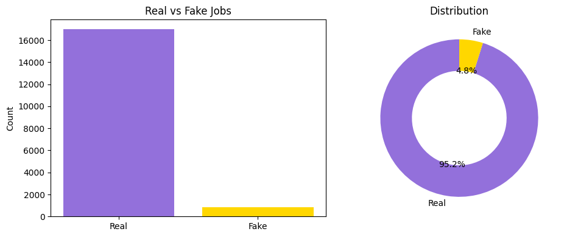
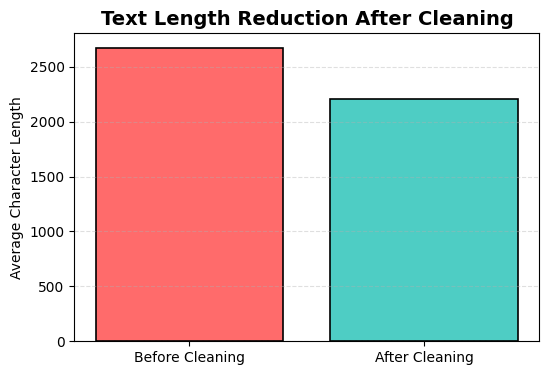
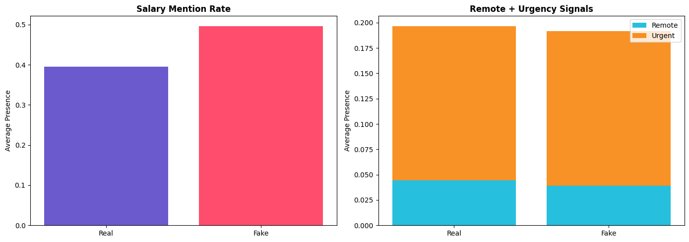
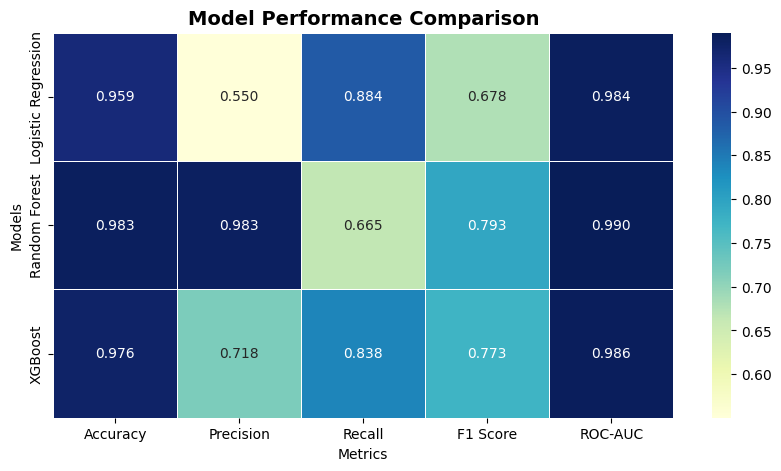
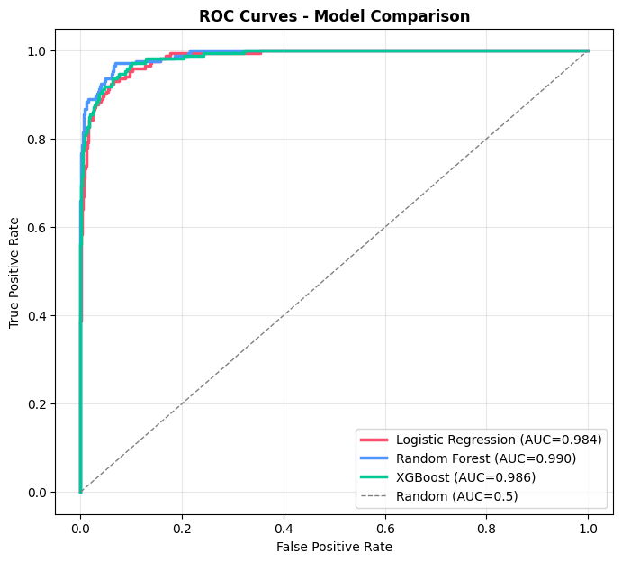
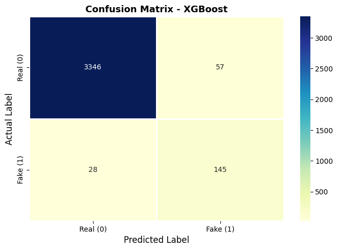

# 🛡️ SafeApply — Fake Job Posting Detector


An end-to-end NLP + Machine Learning pipeline that detects fraudulent job postings — protecting job seekers before they apply.

🚀 **[Live Demo](https://safeapply-fake-job-detection-iza7gg5ywduscya7ulsw8g.streamlit.app/)** &nbsp;·&nbsp; 📓 **[Open in Colab](https://colab.research.google.com/github/priyapoonia0213-art/SafeApply-Fake-Job-Detection/blob/main/fake_job_detection.ipynb)** &nbsp;·&nbsp; 📊 **[Dataset](https://www.kaggle.com/datasets/shivamb/real-or-fake-fake-jobposting-prediction)**

---

## 📌 Table of Contents

- [Problem Statement](#-problem-statement)
- [Dataset](#-dataset)
- [Project Pipeline](#-project-pipeline)
- [Exploratory Data Analysis](#-exploratory-data-analysis)
- [Feature Engineering](#-feature-engineering)
- [Handling Class Imbalance](#-handling-class-imbalance--smote)
- [Models and Results](#-models-and-results)
- [Why XGBoost?](#-why-xgboost)
- [Model Test Results](#-model-test-results)
- [Streamlit Web App](#-streamlit-web-app)
- [Project Structure](#-project-structure)
- [How to Run](#-how-to-run)
- [Tech Stack](#-tech-stack)
- [Key Learnings](#-key-learnings)
- [Future Improvements](#-future-improvements)
- [Limitations](#-limitations)
- [Authors](#-authors)

---

## 🎯 Problem Statement

Fake job postings deceive thousands of job seekers daily — stealing personal information, charging illegal upfront fees, and wasting precious time. SafeApply uses machine learning to automatically flag suspicious listings before a job seeker ever applies.

---

## 📊 Dataset

| Property | Value |
|---|---|
| Source | Kaggle — [Real or Fake Job Posting Prediction](https://www.kaggle.com/datasets/shivamb/real-or-fake-fake-jobposting-prediction) |
| Total Rows | 17,880 job postings |
| Total Columns | 18 features |
| Real Jobs | 17,014 → 95.1% |
| Fake Jobs | 866 → 4.9% |
| Target Column | `fraudulent` (0 = Real, 1 = Fake) |
| Text Columns Used | `title`, `company_profile`, `description`, `requirements`, `benefits` |

The dataset has significant class imbalance — only 4.9% of postings are fake. A naive model that always predicts "Real" scores 95% accuracy while catching zero fraud. This is exactly why **F1-Score and Recall** are the primary metrics, and **SMOTE** is applied to balance training data.

**Missing values (before cleaning):**

| Column | Missing Count |
|---|---|
| salary_range | 15,012 |
| department | 11,547 |
| required_education | 8,105 |
| benefits | 7,212 |
| company_profile | 3,308 |
| requirements | 2,696 |

Columns `salary_range`, `department`, and `job_id` were dropped entirely. All remaining text columns had nulls filled with empty strings.

---

## 🔧 Project Pipeline

```
Raw CSV  (fake_job_postings.csv)
     │
     ▼
1.  Load Dataset — kagglehub download, 17,880 rows × 18 columns
     │
     ▼
2.  Drop Columns — job_id, salary_range, department (too sparse / irrelevant)
     │
     ▼
3.  Fill Nulls — all text columns filled with ""
     │
     ▼
4.  Combine Text — title + company_profile + description +
                   requirements + benefits + employment_type +
                   required_experience + required_education +
                   industry + function + location  →  combined_text
     │
     ▼
5.  Clean Text — lowercase → email_token / number_token substitution
                 → remove special characters → stopword removal → lemmatization
     │
     ▼
6.  Feature Engineering — 11 numerical features + TF-IDF (20,000 features,
                          n-grams 1–3, sublinear_tf=True) → scipy hstack
                          → 20,011 total features
     │
     ▼
7.  Train-Test Split — 80/20, stratify=y (preserves 4.9% fake ratio)
     │
     ▼
8.  SMOTE — training set only: 693 fake → 13,611 fake (balanced 50/50)
     │
     ▼
9.  Train 3 Models — Logistic Regression · Random Forest · XGBoost (with RandomizedSearchCV)
     │
     ▼
10. Evaluate + Select — XGBoost chosen: best F1 + Recall balance
     │
     ▼
11. Save — best_model.pkl · tfidf_vectorizer.pkl · model_info.json
     │
     ▼
12. Streamlit App — paste job posting → instant prediction + fraud probability + warning flags
```

---

## 📈 Exploratory Data Analysis

### 1. Class Distribution

| Label | Count | Share |
|---|---|---|
| Real (0) | 17,014 | 95.1% |
| Fake (1) | 866 | 4.9% |

A naive "always Real" classifier gets 95.1% accuracy — but catches zero fraud. This is why accuracy alone cannot be trusted for this task.



---

### 2. Text Length: Before vs After Cleaning

Real jobs have longer, more detailed descriptions on average (mean: 287 words, max: 1,531 words). Short descriptions under 50 words are a weak but real signal of fraud. After cleaning, average text length drops significantly as stopwords, punctuation, and noise are removed.



---

### 3. Word Clouds — Fake vs Real Jobs

Fake and real job postings share overlapping vocabulary: `work`, `team`, `experience`, `company`. Simple keyword matching won't work — scammers deliberately copy real job language. ML finds the hidden statistical differences that the human eye misses.


---

### 4. Feature Analysis — Salary Mention & Remote/Urgent Language

Fake jobs more often use urgency words and vague remote-work promises without mentioning salary specifics. These patterns were confirmed in EDA and directly shaped the 11 engineered features.



---

## ⚙️ Feature Engineering

**TF-IDF Vectorization**

| Parameter | Value | Reason |
|---|---|---|
| max_features | 20,000 | Top 20,000 most informative tokens |
| ngram_range | (1, 3) | Unigrams + bigrams + trigrams |
| min_df | 2 | Removes extremely rare tokens |
| max_df | 0.95 | Removes near-universal tokens |
| sublinear_tf | True | Log scaling reduces very frequent words |
| Fit on | Training data only | Prevents data leakage into test set |

**11 Engineered Numerical Features** (stacked with TF-IDF via `scipy.sparse.hstack`):

| Feature | Type | What It Captures |
|---|---|---|
| `text_length` | Integer | Fake jobs tend to be shorter and vaguer |
| `word_count` | Integer | Real jobs use more detailed language |
| `has_company_logo` | Binary | Fake jobs less often have verified logos |
| `telecommuting` | Binary | Remote-only claims are a mild signal |
| `has_questions` | Binary | Legitimate jobs usually include screening questions |
| `has_salary` | Binary | Presence of salary/pay/compensation keywords |
| `has_urgent` | Binary | Urgent/immediately/hurry language patterns |
| `has_remote` | Binary | Remote/work-from-home claims |
| `has_email` | Binary | Personal email address (e.g. gmail) present |
| `is_short_desc` | Binary | Word count < 50 |
| `is_long_desc` | Binary | Word count > 500 |

**Total input features: 20,011** (20,000 TF-IDF + 11 engineered)

---

## ⚖️ Handling Class Imbalance — SMOTE

SMOTE (Synthetic Minority Over-sampling Technique) generates synthetic fake job examples so the model sees enough fraud patterns during training.

```
Before SMOTE (training set):
  Real jobs :  13,611  (95.1%)
  Fake jobs :     693   (4.9%)   ← model barely sees fake examples

After SMOTE (training set):
  Real jobs :  13,611  (50%)
  Fake jobs :  13,611  (50%)    ← model learns fraud patterns properly

Test set (never touched by SMOTE):
  Real jobs :   3,403  (95.2%)  ← real-world distribution, honest evaluation
  Fake jobs :     173   (4.8%)
```

SMOTE is applied **only on training data**. Applying it to test data is data leakage and would produce artificially inflated results.

---

## 🤖 Models and Results

All three models were trained on SMOTE-balanced data and evaluated on the original, untouched test set:

| Model | Accuracy | Precision | Recall | F1 Score | ROC-AUC |
|---|---|---|---|---|---|
| Logistic Regression | 0.9595 | 0.5504 | 0.8844 | 0.6785 | 0.9842 |
| Random Forest | 0.9832 | 0.9829 | 0.6647 | 0.7931 | 0.9900 |
| **XGBoost ✅** | **0.9762** | **0.7178** | **0.8382** | **0.7733** | **0.9864** |

### 5. Model Comparison



---

### 6. ROC Curves — All Three Models

All three models achieve ROC-AUC above 0.984, confirming strong discrimination ability across different thresholds.



---

**XGBoost — Final Classification Report (test set):**

```
              precision    recall  f1-score   support

    Real Job       0.99      0.98      0.99      3403
    Fake Job       0.72      0.84      0.77       173

    accuracy                           0.98      3576
   macro avg       0.85      0.91      0.88      3576
weighted avg       0.98      0.98      0.98      3576
```

### 7. XGBoost Confusion Matrix



**XGBoost Hyperparameters** (tuned via RandomizedSearchCV, 3-fold CV):

```python
Best CV F1: 0.7809

Best params: {
    'n_estimators':     200,
    'max_depth':        8,
    'learning_rate':    0.1,
    'subsample':        0.7,
    'colsample_bytree': 0.8,
    'min_child_weight': 3,
    'scale_pos_weight': 19.6   # neg/pos ratio from original training data
}
```

**Threshold Analysis:**

| Threshold | Recall | Precision | F1 |
|---|---|---|---|
| 0.3 | 0.8728 | 0.7295 | 0.7947 |
| 0.4 | 0.8555 | 0.8000 | 0.8268 |
| 0.5 | 0.8382 | 0.8529 | 0.8455 |

---

## 🏆 Why XGBoost?

| Model | Strength | Weakness | Verdict |
|---|---|---|---|
| Logistic Regression | Highest Recall (0.8844) | Precision only 0.55 — too many false alarms on real jobs | ❌ Not deployment-ready |
| Random Forest | Highest Precision (0.9829) | Recall only 0.6647 — misses 1 in 3 fake jobs | ❌ Too many frauds slip through |
| XGBoost | Best F1 (0.7733) with strong Recall (0.8382) | Middle precision | ✅ Best overall balance |

For fraud detection, **Recall matters more than Precision**. Missing a fake job harms the job seeker more than a false alarm ever would. XGBoost catches 83.8% of all fake jobs while keeping false alarms reasonable.

---

## 🧪 Model Test Results

| Input | Prediction | Fake Probability |
|---|---|---|
| "URGENT HIRING — Data Entry, $4000–$8000/month, no interview, gmail contact" | ⚠️ FAKE JOB | 0.7609 |
| "Software Engineer, ABC Technologies, Bangalore, 2+ years Python/SQL" | ✅ GENUINE JOB | 0.0129 |

---

## 🌐 Streamlit Web App

A 4-page interactive app built with Streamlit:

| Page | What It Does |
|---|---|
| 🏠 Home | Common red flags explained, project overview |
| 🔎 Detect Fake Job | Paste any job posting → instant prediction + fraud probability gauge + feature flags |
| 📊 Model Performance | Full comparison of all 3 models — metrics table and bar charts |
| ℹ️ About Project | Full ML pipeline walkthrough, dataset info, tech stack |

---

## 📁 Project Structure

```
SafeApply-Fake-Job-Detection/
│
├── 📓 fake_job_detection.ipynb      ← Full Google Colab training notebook
│
├── 🌐 app.py                        ← Streamlit web app (lives at root level)
│
├── 🤖 models/
│   ├── best_model.pkl               ← Saved XGBoost model
│   ├── tfidf_vectorizer.pkl         ← Saved TF-IDF vectorizer (20,000 features)
│   └── model_info.json              ← Model performance summary
│
├── 📊 assets/
│   ├── class_distribution.png       ← Class imbalance bar chart
│   ├── text_length_reduction.png   ← Text length before vs after cleaning
│   ├── wordclouds.png               ← Word clouds for fake vs real jobs
│   ├── feature_analysis.png         ← Salary/urgency/remote feature analysis
│   ├── model_comparison.png         ← Side-by-side model metrics bar chart
│   ├── roc_curves.png               ← ROC curves for all 3 models
│   └── confusion_matrix.png         ← XGBoost confusion matrix
│
├── requirements.txt
└── README.md
```

> ⚠️ **Note:** If your actual asset filenames differ from the ones listed above, update the `` references in this README to match exactly — GitHub image embeds are case-sensitive.

---

## ▶️ How to Run

**Option 1 — Run Locally**

```bash
# 1. Clone the repository
git clone https://github.com/priyapoonia0213-art/SafeApply-Fake-Job-Detection.git
cd SafeApply-Fake-Job-Detection

# 2. Install dependencies
pip install -r requirements.txt

# 3. Run the app
streamlit run app.py
```

**Option 2 — Train from Scratch (Google Colab)**

1. Open **[Fake_Job_Detection.ipynb](https://colab.research.google.com/github/priyapoonia0213-art/SafeApply-Fake-Job-Detection/blob/main/Fake_Job_Detection.ipynb)** in Google Colab
2. Download `fake_job_postings.csv` from **[Kaggle](https://www.kaggle.com/datasets/shivamb/real-or-fake-fake-jobposting-prediction)**
3. Run all cells — model files are automatically saved to `models/`
4. Download `best_model.pkl`, `tfidf_vectorizer.pkl`, `model_info.json` and place them in the `models/` folder

---

## 🛠️ Tech Stack

| Category | Library / Tool |
|---|---|
| Data | pandas, numpy |
| NLP | TfidfVectorizer (scikit-learn), NLTK — lemmatization & stopwords |
| ML | scikit-learn (Logistic Regression, Random Forest), XGBoost |
| Imbalance Handling | imbalanced-learn (SMOTE) |
| Sparse Matrix | scipy (hstack) |
| Hyperparameter Tuning | RandomizedSearchCV — 3-fold stratified CV |
| Visualization | matplotlib, seaborn, wordcloud |
| Web App | Streamlit |
| Model Saving | joblib |
| Environment | Google Colab |

---

## 💡 Key Learnings

- **Accuracy is misleading on imbalanced data** — F1-Score and Recall are the only metrics that matter here; 95% accuracy can mean zero fraud caught.
- **SMOTE on training data only** — applying it to the test set causes data leakage and inflates results dishonestly.
- **TF-IDF must be fit on training data only** — fitting on the full dataset leaks test information into the model.
- **Trigrams add real signal** — phrases like "no experience required" carry far more meaning than individual words.
- **Random Forest's high precision is a trap** — it misses 33% of actual frauds, which is the worst possible outcome here.
- **Threshold tuning changes everything** — XGBoost at threshold 0.4 yields F1 of 0.8268 vs 0.7733 at default 0.5.
- **scale_pos_weight = 19.6** — passing the class ratio to XGBoost gives it native imbalance awareness, complementing SMOTE.

---

## 🚀 Future Improvements

- **SHAP explainability** — show users exactly which words drove each prediction, making the model transparent.
- **BERT embeddings** — replace TF-IDF with contextual embeddings to understand semantic meaning, not just frequency.
- **Optuna hyperparameter tuning** — Bayesian optimization for more efficient and accurate hyperparameter search.
- **MLflow experiment tracking** — log every run's params, metrics, and artifacts for reproducibility.
- **India-specific training data** — add Naukri/LinkedIn India/Internshala data to catch region-specific fraud patterns.
- **Categorical feature encoding** — label-encode `employment_type`, `industry`, and `required_experience` as model inputs.
- **Systematic threshold optimization** — use full ROC curve analysis on a held-out validation set to find the optimal cutoff.

---

## ⚠️ Limitations

- The EMSCAD dataset is primarily English-language Western job postings — Indian-specific or vernacular fraud patterns may be underrepresented.
- `employment_type`, `industry`, and `required_experience` are not currently used as label-encoded model features.
- No model explainability layer yet — the model gives a probability score but does not tell users *why* a posting was flagged.

---

## 👤 Authors

**Priya · Bhawana · Saloni**

Built with 🤍 using Python · Scikit-learn · XGBoost · Streamlit